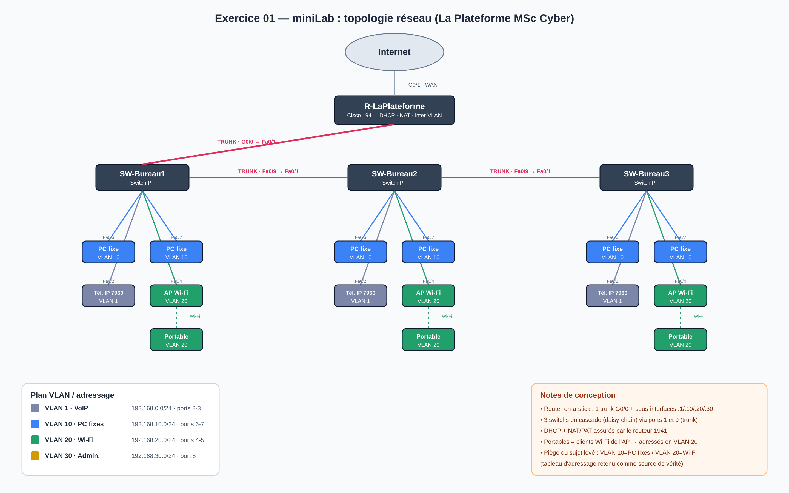

# Exercice 01 — miniLab réseau (Cisco Packet Tracer)

Configuration d'un réseau d'entreprise multi-VLAN sur 3 bureaux, avec routage
inter-VLAN, DHCP centralisé et accès Internet (NAT), à réaliser dans Cisco Packet Tracer.

## Matériel

| Équipement | Quantité | Rôle |
|------------|----------|------|
| Routeur Cisco 1941 | 1 | Passerelle Internet (NAT), routage inter-VLAN, serveur DHCP |
| Switch PT | 3 | Commutation d'accès (1 par bureau) |
| Point d'accès Wi-Fi PT-AC | 3 | Wi-Fi (1 par bureau) |
| PC portables | 3 | Clients Wi-Fi (1 par bureau) |
| PC fixes | 6 | Postes filaires (2 par bureau) |
| Téléphones IP Cisco 7960 | 3 | VoIP (1 par bureau) — l'IPBX n'est pas à gérer |

## ⚠️ Incohérence du sujet (piège) et décision retenue

Le sujet contient **deux tableaux qui se contredisent** sur les VLAN 10 et 20 :

| Source dans le sujet | VLAN 10 | VLAN 20 |
|----------------------|---------|---------|
| Tableau des **ports** (ports 4-5 vs 6-7) | Points d'accès Wi-Fi | PC fixes |
| Tableau **d'adressage** | PC fixes (192.168.10.0/24) | Wi-Fi (192.168.20.0/24) |

**Décision :** on retient le **tableau d'adressage comme source de vérité**
(il porte le plan IP détaillé + les plages DHCP). D'où le mapping final appliqué
partout, de façon cohérente :

- **VLAN 10 = PC fixes** → ports d'accès **6-7**
- **VLAN 20 = Wi-Fi**   → ports d'accès **4-5**

Les VLAN 1 (VoIP) et 30 (Administration) sont, eux, cohérents dans les deux tableaux.

## Plan VLAN et adressage

| VLAN | Usage | Réseau | Passerelle | Plage DHCP | Ports switch |
|------|-------|--------|------------|------------|--------------|
| 1  | VoIP (téléphones IP) | 192.168.0.0/24  | 192.168.0.1  | .10 – .50 | 2-3 |
| 10 | PC fixes             | 192.168.10.0/24 | 192.168.10.1 | .10 – .50 | 6-7 |
| 20 | Wi-Fi (AP + portables) | 192.168.20.0/24 | 192.168.20.1 | .10 – .50 | 4-5 |
| 30 | Administration       | 192.168.30.0/24 | 192.168.30.1 | .10 – .50 | 8 |
| — | Uplink (trunk 802.1Q) | — | — | — | 1 et 9 |

> Les plages DHCP sont limitées à **.10 – .50** grâce aux `ip dhcp excluded-address`
> (.1–.9 et .51–.254 exclus), conformément à la colonne « Plage DHCP » du sujet.

## Topologie



**Câblage (daisy-chain des switchs via les ports trunk 1 et 9) :**

```
Internet ── (G0/1 WAN) R-LaPlateforme (G0/0 trunk)
                              │
                          Fa0/1 (trunk)
                              │
   SW-Bureau1 ──Fa0/9──Fa0/1── SW-Bureau2 ──Fa0/9──Fa0/1── SW-Bureau3
```

Le routeur ne possède que 2 interfaces Gigabit : **G0/0** porte le trunk LAN
(router-on-a-stick, une sous-interface par VLAN) et **G0/1** est la sortie Internet.
Les 3 switchs sont donc chaînés entre eux par leurs ports d'uplink (1 et 9).

## Répartition par bureau (identique sur les 3)

- 1 switch PT
- 2 PC fixes → ports 6-7 (VLAN 10)
- 1 point d'accès Wi-Fi → port 4 (VLAN 20)
- 1 PC portable → connecté **en Wi-Fi** à l'AP → adressé dans le VLAN 20
- 1 téléphone IP → port 2 (VLAN 1 / VoIP)
- Port 8 disponible pour l'Administration (VLAN 30) + SVI de management du switch

## Process de configuration

1. **Placer et câbler** les équipements selon la topologie ci-dessus.
2. **Switchs** — pour chacun (`configs/SW-BureauX.txt`) :
   - créer les VLAN 10, 20, 30 (le VLAN 1 existe par défaut) ;
   - affecter les ports d'accès (2-3 → VLAN 1, 4-5 → VLAN 20, 6-7 → VLAN 10, 8 → VLAN 30) ;
   - passer les ports 1 et 9 en **trunk** ;
   - configurer une **SVI VLAN 30** pour l'administration distante du switch.
3. **Routeur** (`configs/Router-1941.txt`) :
   - sous-interfaces 802.1Q sur G0/0 (`.1` native, `.10`, `.20`, `.30`) = **routage inter-VLAN** ;
   - **4 pools DHCP** (un par VLAN) + exclusions pour respecter la plage .10–.50 ;
   - **G0/1** en sortie Internet + **NAT/PAT** (`ip nat inside/outside` + `access-list` + overload).
4. **Configurer les AP** (SSID) et associer les portables au Wi-Fi.
5. **Tester** (voir ci-dessous).

Les configurations complètes, prêtes à coller dans le CLI, sont dans [`configs/`](./configs).

## Tests de validation (à faire dans Packet Tracer)

```
! Sur le routeur : voir les baux DHCP distribués
show ip dhcp binding
! Voir les sous-interfaces et le routage
show ip interface brief
show ip route
! Voir les VLAN et trunks sur un switch
show vlan brief
show interfaces trunk
! Vérifier le NAT
show ip nat translations
```

Connectivité à valider :
- [ ] Chaque PC/téléphone/portable obtient une IP DHCP dans le bon VLAN (.10–.50).
- [ ] **Ping inter-VLAN** : un PC fixe (VLAN 10) joint un portable Wi-Fi (VLAN 20), un téléphone (VLAN 1), etc.
- [ ] **Ping inter-bureaux** : un PC du bureau 1 joint un PC du bureau 3.
- [ ] **Accès Internet** : ping depuis un PC vers une adresse publique (ex. 8.8.8.8) → NAT OK.

## Livrables (à mettre sur GitHub)

- [x] `README.md` — ce fichier (process + décisions)
- [x] `configs/` — export des configurations (routeur + 3 switchs)
- [x] `topologie.png` — schéma de la topologie
- [ ] `LaPlateforme-miniLab.pkt` — **le fichier Packet Tracer** (à construire dans le GUI en collant les configs)
- [ ] `screenshots/` — captures du lab qui fonctionne (VLAN, DHCP binding, ping inter-VLAN, accès Internet)

> Montage du fichier `.pkt` : coller les configurations de [`configs/`](./configs) dans
> chaque équipement, puis capturer les tests de validation ci-dessus.
